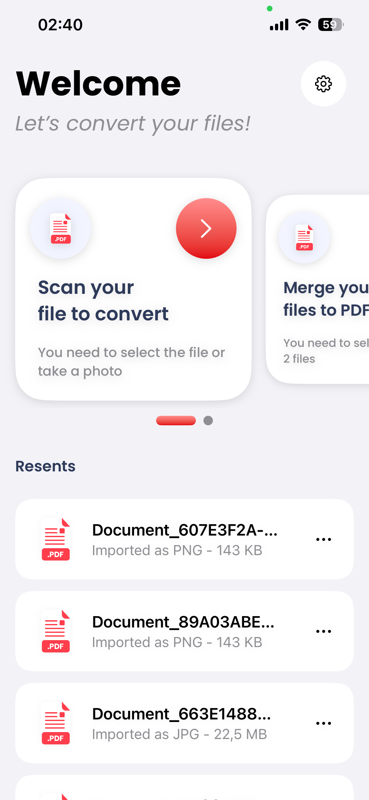
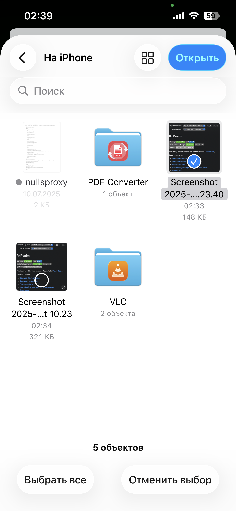
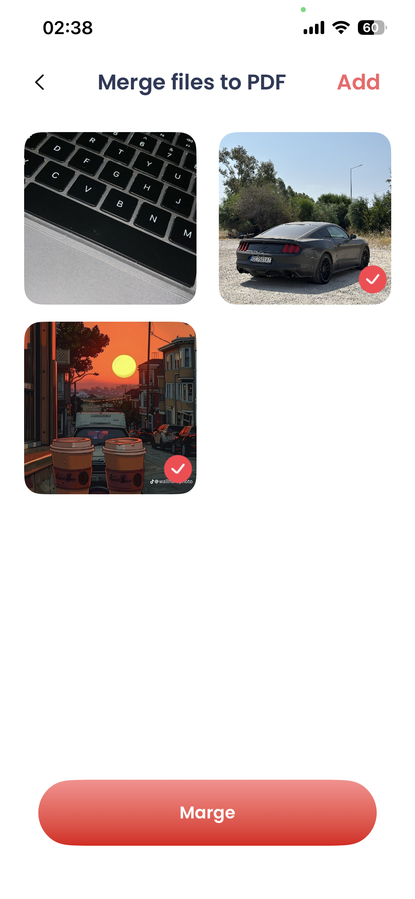
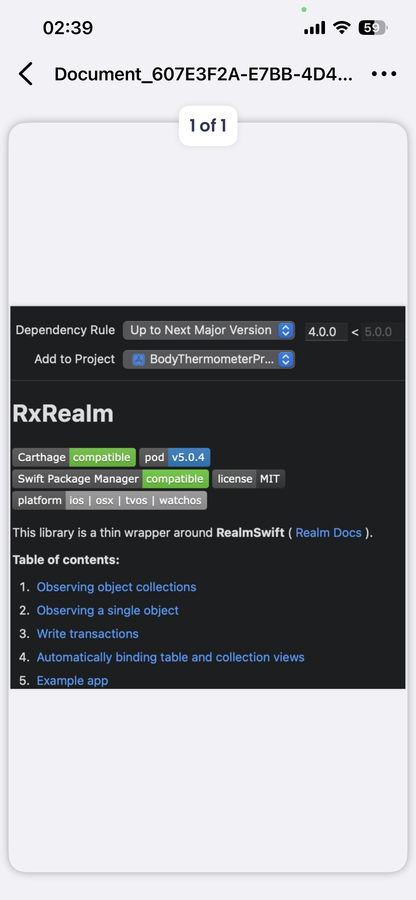

# PDFMaster

**PDFMaster** is an iOS application that allows users to easily create and manage PDF files.  
You can merge multiple files into a single PDF, convert photos into PDF documents, and keep all created files stored in the app history.  
Additionally, all generated PDFs are saved in the **PDF Converter** folder for quick access.  

---

## Features
- Create new PDF files  
- Merge multiple files into a single PDF  
- Take photos and convert them into PDF  
- All created files are saved in history  
- Files are also duplicated into the **PDF Converter** folder  
- Built with SwiftUI and modern navigation  

---

## Requirements
- iOS 16.0+  
- Xcode 15+  
- Swift 5.9+  

---

## 📦 Technologies
- SwiftUI + SUINavigation  
- CoreData (for file history persistence)  
- UIKit integration for photo handling 

---

## Screenshots

<p float="left">
  
  
  
  
</p>

---

## Installation
1. Clone the repository:  
   ```bash
   git clone https://github.com/your-username/PDFMaster.git
   cd PDFMaster
